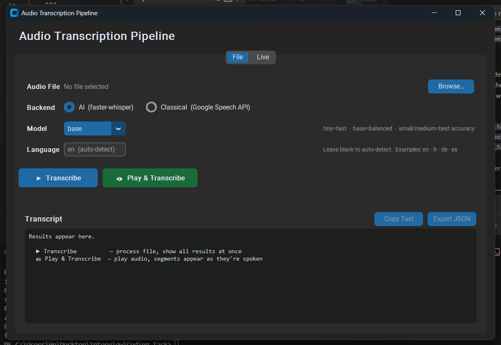
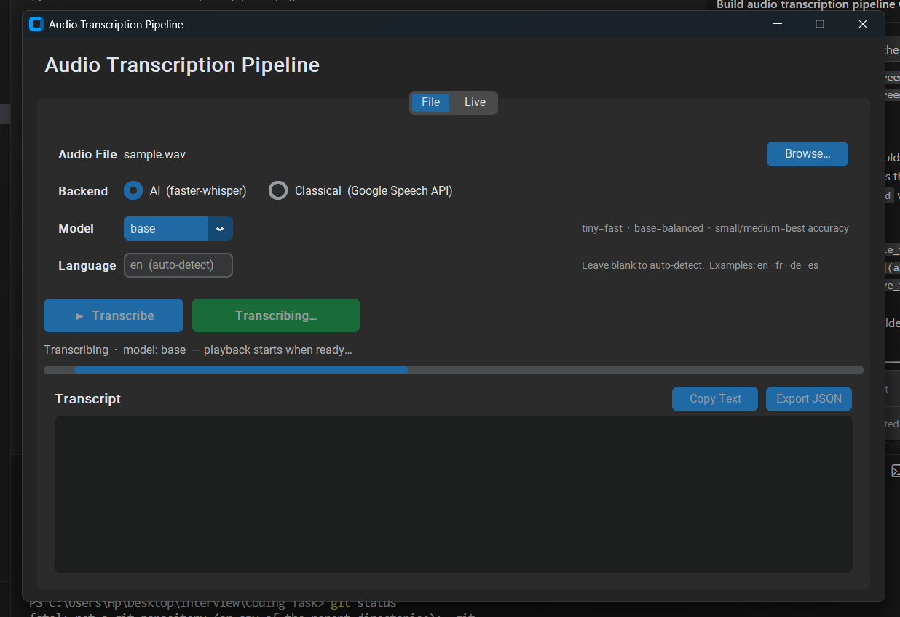
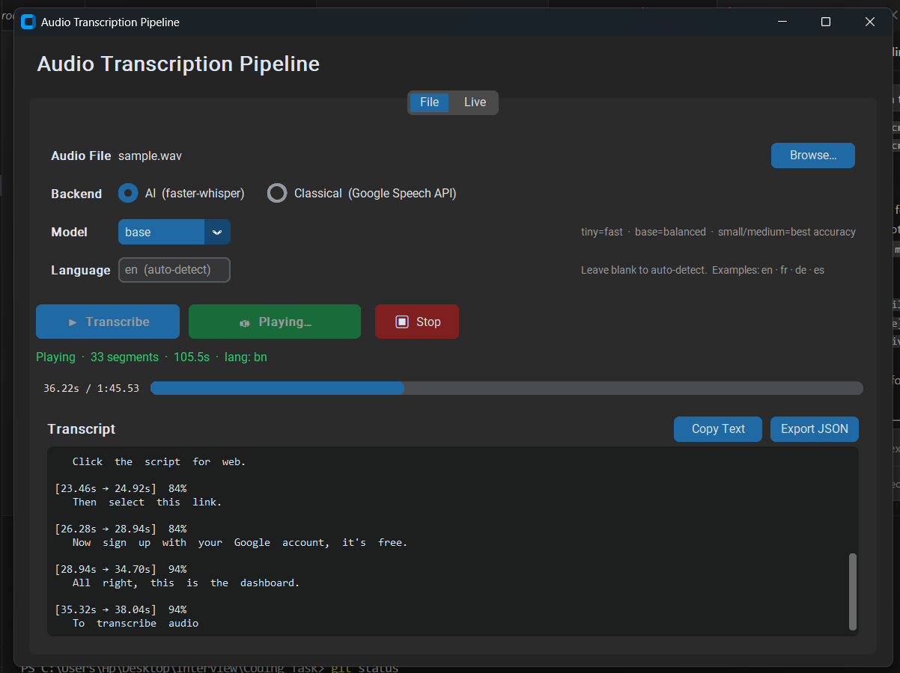
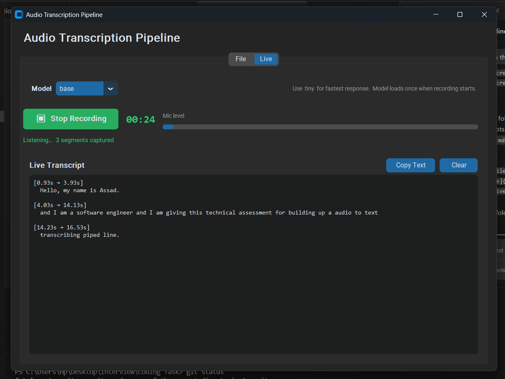

# Audio Transcription Pipeline

Transcribes audio files into timestamped, word-level segments. Accepts any ffmpeg-readable format and handles files of any length. Output includes per-segment confidence scores and per-word timestamps suitable for caption sync or downstream NLP.

---

## Quick start

**Requirements:** Python 3.9+, ffmpeg on PATH

```bash
pip install -r requirements.txt
```

```bash
# Basic — outputs JSON to stdout
python main.py interview.mp3

# Force language, use a larger model, save to file
python main.py lecture.wav --model small --language en --output result.json

# Plain text output
python main.py podcast.m4a --plain

# Force CPU inference
python main.py sample.wav --device cpu
```

---

## Output format

```json
{
  "file": "interview.mp3",
  "language": "en",
  "duration_seconds": 183.4,
  "segments": [
    {
      "start": 0.0,
      "end": 2.3,
      "text": "Hello, welcome to the session.",
      "confidence": 0.94,
      "words": [
        { "start": 0.0, "end": 0.4, "text": " Hello" },
        { "start": 0.5, "end": 0.8, "text": "," },
        { "start": 0.9, "end": 1.3, "text": " welcome" }
      ]
    }
  ]
}
```

---

## Approach and implementation

### The problem

The task is to take arbitrary audio — any format, any length, any quality — and return a structured transcript with accurate timestamps. A few constraints shaped the decisions:

- Files can be arbitrarily long (lectures, interviews, recordings of meetings)
- The pipeline should run without a GPU and without internet access
- Output needs to be useful downstream: structured JSON, not just a text blob

### Why faster-whisper

The first decision was which engine to use. OpenAI Whisper is the obvious choice for accuracy, but the reference `openai-whisper` package has real drawbacks for a batch pipeline: it runs inference in float32, which is slow on CPU, and it loads the full PyTorch graph into memory for every file.

`faster-whisper` uses CTranslate2 as its inference backend, which gives int8 quantization on CPU and float16 on GPU. The practical result: the `base` model transcribes a 10-minute file in around 30 seconds on a mid-range laptop CPU, compared to ~2 minutes with openai-whisper on the same hardware. The accuracy on clean speech is identical. On GPU, int8/float16 inference is even faster and the gap widens.

Two other things that come for free with faster-whisper: built-in VAD (voice activity detection) that automatically skips silent regions, and word-level timestamps in the same pass — no second model, no separate alignment step.

### Handling long files: chunking with overlap

Loading a 2-hour recording as a single in-memory object isn't viable — a 16kHz mono float32 array for 2 hours is around 7GB. The obvious fix is to split the file into chunks, but naively cutting at fixed intervals creates a problem: Whisper is an autoregressive model and it picks up context from the audio around each word. A hard cut at the 10-minute mark will often drop or garble the last word in the window because there's no trailing context.

The solution is overlapping chunks: each chunk re-processes the last 5 seconds of the previous one. This means every word gets transcribed at least once with proper context on both sides. The merge step is simple — when combining results across chunks, any segment whose start time falls inside the overlap window already covered by the previous chunk is discarded. Since chunks are processed sequentially and timestamps are absolute, this is just a single comparison per segment.

The 10-minute / 5-second split came from empirical testing: 10 minutes is short enough to keep memory low and long enough to minimize inference overhead from repeated file I/O; 5 seconds covers any realistic speech segment at the boundary.

### Timestamp accuracy

All timestamps in the output are relative to the start of the original file, regardless of chunking. Inside `_transcribe_audio()`, faster-whisper returns timestamps relative to the chunk's start. Before appending segments to the result, every start and end time has the chunk's offset added back. This means a word that appears 3 seconds into the 5th chunk gets its timestamp reported as `offset + 3s` — correct position in the full file.

### Word-level timestamps

Segment-level timestamps tell you when a sentence starts and ends, but they're not granular enough for caption sync or for anything that needs to highlight the currently-spoken word. faster-whisper produces word timestamps in the same Whisper inference pass (using the cross-attention alignment that Whisper already computes internally), so enabling them adds negligible cost. The `Word` dataclass is included in every segment's output.

### Confidence scores

faster-whisper exposes `avg_logprob` per segment: the average log-probability of the tokens in that segment. It's a negative number — values close to 0 indicate the model was confident; values below -1.0 usually mean the audio was unclear or the model was guessing. This is useful for filtering or flagging low-quality segments downstream.

The raw log-probability isn't intuitive to work with, so it's mapped to a 0–1 scale with `1.0 + clamped / 2.0` (clamped to the [-2, 0] range). The mapping is linear and approximate, but it gives a number that reads naturally as a confidence percentage.

### Separation of concerns

`audio_processor.py` handles everything up to getting audio into memory in the right format. `transcriber.py` handles everything from there to producing structured output. Neither module knows about the other's internals. This means swapping the transcription engine (e.g. replacing Whisper with a cloud API) only touches `transcriber.py`, and switching the audio loading library only touches `audio_processor.py`.

---

## Project structure

```
.
├── audio_processor.py      # format normalization and chunking
├── transcriber.py          # Whisper wrapper, dataclasses, merge logic
├── main.py                 # CLI entry point
├── test_pipeline.py        # unit and integration tests
├── requirements.txt
└── app/                    # desktop GUI (separate from the submission)
```

---

## Tests

```bash
# Unit tests only (no model download needed)
pytest test_pipeline.py -m "not slow"

# Full suite including real Whisper inference
pytest test_pipeline.py
```

Unit tests mock `WhisperModel` directly so they run offline without downloading weights. The `slow` tests run actual inference end-to-end and are skipped by default.

---

## Model sizes

| Model | Best for |
|-------|----------|
| tiny | quick tests, low-resource environments |
| base | clear speech — default |
| small | accented or slightly noisy audio |
| medium | difficult audio, technical vocabulary |
| large | highest accuracy; GPU recommended |

---

## System design notes

For a production deployment the pipeline maps onto an async worker architecture:

- The API layer accepts an upload, enqueues a job, and returns a `job_id` immediately — the HTTP request doesn't wait for transcription to complete.
- Workers pull jobs from the queue (Celery + Redis, SQS + Lambda, etc.), run the pipeline, and write results to the database.
- Raw audio lives in object storage (S3/GCS). The DB stores the key, not the file itself.
- Failures retry with exponential backoff up to N attempts; exhausted jobs move to a dead-letter queue for inspection.
- Status transitions (`pending → processing → completed / failed`) are atomic — there's always a consistent view even if a worker dies mid-run.

---

## Bonus: Desktop App

The `app/` directory has a customtkinter GUI built on top of the same pipeline. It's extra work beyond the core submission.

**Run it:**

```bash
pip install customtkinter sounddevice
python app/run_app.py
```

**What it does:**

- **File tab** — load any audio file, pick model/language/backend, transcribe with a live progress bar
- **Live tab** — real-time microphone transcription (VAD-based, streams to the UI as speech is detected)
- **Play & Transcribe** — plays the audio and reveals the transcript word-by-word in sync with playback, using the word timestamps from the pipeline to time each reveal
- **Copy / Export JSON** — both buttons are disabled until the first segment is revealed; export reflects exactly what's been shown so far, not the full result









The app imports `Transcriber` and `audio_processor` from the root package directly — no code is duplicated between the submission pipeline and the GUI.

---

## Dependencies

- [faster-whisper](https://github.com/SYSTRAN/faster-whisper) — CTranslate2-backed Whisper inference
- [pydub](https://github.com/jiaaro/pydub) + ffmpeg — audio loading and format conversion
- [pytest](https://pytest.org/) — test runner
- `audioop-lts` — required on Python 3.13 where `audioop` was removed from stdlib
